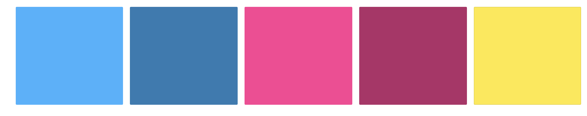

# [Waggy Box](https://waggy-box.herokuapp.com/)

Waggy Box (fictional) is a dog treat and toy subscription box for pet owners in Ireland. Finding durable toys and tasty treats has been the most difficult task I've encountered as a pet owner.  So, the idea of Waggy Box was created, to allieviate this difficulty.  All toys are tried and tested by my own three dogs, and only the toys approved by these guys will be featured in the monthly box. 

---
## **User Experience**

#### **User Stories**

- As a customer I want to: 
    - View the site from any device
    - Create an account.
    - Be able to login/out without purchasing a subscription. 
    - Gain additional features once I subscribe to a box.
    - Choose the box type I would like to subscribe to & enter my own details for delivery
    - Access my subscription overview where I can review my own information and subscription type. 
    - Cancel or change my subscription type as I wish.
    - Visit an online shop that contains any items from the previous months box.
    - Be able to purchase these items for delivery
    - Read information on any items from the previous months subscription service
    - Find out more about the Waggy Box company as a whole
    - Be able to submit a contact form to get in touch with the site owner
 

---

## **Design** 

Waggy Box was designed with ease and playfulness in mind. Making use of bright colours and two sans-serif fonts with varying weights to ensure accurate emphasis is given to the secions. 

This project was aimed at dog owners and dog lovers, who regularly struggle to find great toys and treats tasty enough to train and play with their furry friends. 

Waggy-Box' site is split into two parts :

**Free Tier:**

Users are initially registered on the free tier page.  They have a limited view of what the site offers, in terms of being able to navigate to the subscription page and to contact the site owners. 

**Paid Tier:**

The paid tier users have full access to the website.  They can review items in next month's box, shop items from the previous month, contact the site owner and adjust their own subscription plan. 

#### **Colour Scheme**

#### **Typography**
 
 - **Montserrat:**
    - The primary font across the webiste, using four different weights: 200, 300, 400, 500
    - Montserrat is a clean font used regularly, so it is both an attractive and appropriate choice to be the primary font across the site.

- **Rubik**
    - Rubik was used for the main page headings, of a weight 500 for the page headings and 300 for the sub-heading sections.
    - Rubik added the element of playfulness to the application, without making it appear childish. 

### **Frameworks**
- [MDBoostrap](https://mdbootstrap.com/)
    - Taking the responsiveness of Bootstrap and the front-end UI of Materialize, MDBoostrap makes use of both of these. So all aspects of the site were clean and accessible for all users. 

- [JQuery](https://code.jquery.com/jquery/)
    - In order to minimalise the amount of Javascript used across the application, I chose to implenent a lot of the JS functionality with JQuery.

- [Django 3.0](https://docs.djangoproject.com/en/3.0/releases/3.0/) 
    - Django is a free and open-source web framework that I've used to render the back-end Python code with the front-end MDBoostrap and my own custom HTML and CSS. 

### **Icons**

- [MDBoostrap Icons](https://mdbootstrap.com/)
    - A majority of icons used across the website were taken from MDBoostrap documentation. These icons are adapted from both Font Awesome and Materialize icons due to their clean appearence. 
- [Canva](https://www.canva.com/) 
    - Canva was the source of other Icons.  I purchased a pro subscription to canva for the duration of the project.  Canva has an extensive library of images and icons for use by designers and developers alike.
    - The Waggy Box logo was also created using a canva logo template and customised to fit the feel and appearence of Waggy Box.

### **Wireframes**

- **Desktop**
    - [Landing page](wireframes/desktop/landing-desktop.png)
    - [About page](wireframes/desktop/about-desktop.png)
    - [Contact](wireframes/desktop/contact-desktop.png)
    - [Login](wireframes/desktop/login-desktop.png)
    - [Signup](wireframes/desktop/signup-desktop.png)
    - [Dashboard](wireframes/desktop/dashboard-desktop.png)
    - [Subscription-Overview](wireframes/desktop/subscription-desktop.png)
    - [Shop](wireframes/desktop/shop-desktop.png)
    - [Checkout](wireframes/desktop/checkout-desktop.png)

- **Tablet**
    - [Landing page](wireframes/tablet/landing-tablet.png)
    - [About page](wireframes/tablet/about-tablet.png)
    - [Contact](wireframes/tablet/contact-tablet.png)
    - [Login](wireframes/tablet/login-tablet.png)
    - [Signup](wireframes/tablet/signup-tablet.png)
    - [Dashboard](wireframes/tablet/dashboard-tablet.png)
    - [Subscription-Overview](wireframes/tablet/subscription-tablet.png)
    - [Shop](wireframes/tablet/shop-tablet.png)
    - [Checkout](wireframes/tablet/checkout-tablet.png)
    
- **Mobile**
    - [Landing page](wireframes/mobile/landing-mobile.png)
    - [About page](wireframes/mobile/about-mobile.png)
    - [Contact](wireframes/mobile/contact-mobile.png)
    - [Login](wireframes/mobile/login-mobile.png)
    - [Signup](wireframes/mobile/signup-mobile.png)
    - [Dashboard](wireframes/mobile/dashboard-mobile.png)
    - [Subscription-Overview](wireframes/mobile/subscription-mobile.png)
    - [Shop](wireframes/mobile/shop-mobile.png)
    - [Checkout](wireframes/mobile/checkout-mobile.png)    

