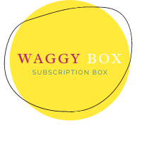
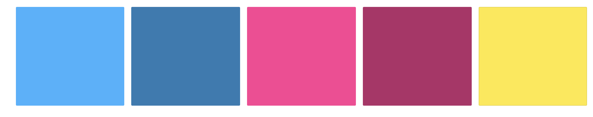

<h2 align=center></h2>

# [Waggy Box](https://waggy-box.herokuapp.com/)

Waggy Box (fictional) is a dog treat and toy subscription box for pet owners in Ireland. Finding durable toys and tasty treats has been the most difficult task I've encountered as a pet owner.  So, the idea of Waggy Box was created, to allieviate this difficulty.  All toys are tried and tested by my own three dogs, and only the toys approved by these guys will be featured in the monthly box. 

---
<h2 align=center><strong>User Experience</strong></h2>

#### **User Stories**

- As a customer I want to: 
    - View the site from any device
    - Create an account.
    - Be able to login/out without purchasing a subscription. 
    - Gain additional features once I subscribe to a box.
    - Choose the box type I would like to subscribe to & enter my own details for delivery
    - Access my subscription overview where I can review my own information and subscription type. 
    - Cancel or change my subscription type as I wish.
    - Visit an online shop that contains any items from the previous months box.
    - Be able to purchase these items for delivery
    - Read information on any items from the previous months subscription service
    - Find out more about the Waggy Box company as a whole
    - Be able to submit a contact form to get in touch with the site owner
 

---

<h3 align=center><strong>User Experience</strong></h3>
 

Waggy Box was designed with ease and playfulness in mind. Making use of bright colours and two sans-serif fonts with varying weights to ensure accurate emphasis is given to the secions. 

This project was aimed at dog owners and dog lovers, who regularly struggle to find great toys and treats tasty enough to train and play with their furry friends. 

Waggy-Box' site is split into two parts :

**Free Tier:**

Users are initially registered on the free tier page.  They have a limited view of what the site offers, in terms of being able to navigate to the subscription page and to contact the site owners. 

**Paid Tier:**

The paid tier users have full access to the website.  They can review items in next month's box, shop items from the previous month, contact the site owner and adjust their own subscription plan. 

#### **Colour Scheme**

#### **Typography**
 
 - **Montserrat:**
    - The primary font across the webiste, using four different weights: 200, 300, 400, 500
    - Montserrat is a clean font used regularly, so it is both an attractive and appropriate choice to be the primary font across the site.

- **Rubik**
    - Rubik was used for the main page headings, of a weight 500 for the page headings and 300 for the sub-heading sections.
    - Rubik added the element of playfulness to the application, without making it appear childish. 

### **Frameworks**
- [MDBoostrap](https://mdbootstrap.com/)
    - Taking the responsiveness of Bootstrap and the front-end UI of Materialize, MDBoostrap makes use of both of these. So all aspects of the site were clean and accessible for all users. 

- [JQuery](https://code.jquery.com/jquery/)
    - In order to minimalise the amount of Javascript used across the application, I chose to implenent a lot of the JS functionality with JQuery.

- [Django 3.0](https://docs.djangoproject.com/en/3.0/releases/3.0/) 
    - Django is a free and open-source web framework that I've used to render the back-end Python code with the front-end MDBoostrap and my own custom HTML and CSS. 

### **Icons**

- [MDBoostrap Icons](https://mdbootstrap.com/)
    - A majority of icons used across the website were taken from MDBoostrap documentation. These icons are adapted from both Font Awesome and Materialize icons due to their clean appearence. 
- [Canva](https://www.canva.com/) 
    - Canva was the source of other Icons.  I purchased a pro subscription to canva for the duration of the project.  Canva has an extensive library of images and icons for use by designers and developers alike.
    - The Waggy Box logo was also created using a canva logo template and customised to fit the feel and appearence of Waggy Box.

### **Wireframes**

- **Desktop**
    - [Landing page](design/wireframes/desktop/landing-desktop.png)
    - [About page](design/wireframes/desktop/about-desktop.png)
    - [Contact](design/wireframes/desktop/contact-desktop.png)
    - [Login](design/wireframes/desktop/login-desktop.png)
    - [Signup](design/wireframes/desktop/signup-desktop.png)
    - [Dashboard](design/wireframes/desktop/dashboard-desktop.png)
    - [Subscription-Overview](design/wireframes/desktop/subscription-desktop.png)
    - [Shop](design/wireframes/desktop/shop-desktop.png)
    - [Checkout](design/wireframes/desktop/checkout-desktop.png)

- **Tablet**
    - [Landing page](design/wireframes/tablet/landing-tablet.png)
    - [About page](design/wireframes/tablet/about-tablet.png)
    - [Contact](design/wireframes/tablet/contact-tablet.png)
    - [Login](design/wireframes/tablet/login-tablet.png)
    - [Signup](design/wireframes/tablet/signup-tablet.png)
    - [Dashboard](design/wireframes/tablet/dashboard-tablet.png)
    - [Subscription-Overview](design/wireframes/tablet/subscription-tablet.png)
    - [Shop](design/wireframes/tablet/shop-tablet.png)
    - [Checkout](design/wireframes/tablet/checkout-tablet.png)

- **Mobile**
    - [Landing page](design/wireframes/mobile/landing-mobile.png)
    - [About page](design/wireframes/mobile/about-mobile.png)
    - [Contact](design/wireframes/mobile/contact-mobile.png)
    - [Login](design/wireframes/mobile/login-mobile.png)
    - [Signup](design/wireframes/mobile/signup-mobile.png)
    - [Dashboard](design/wireframes/mobile/dashboard-mobile.png)
    - [Subscription-Overview](design/wireframes/mobile/subscription-mobile.png)
    - [Shop](design/wireframes/mobile/shop-mobile.png)
    - [Checkout](design/wireframes/mobile/checkout-mobile.png)    

<h2 align=center><strong>Features</strong></h2>

### **Current Features**

#### **Elements on every page:**

- **Navbar**
    - Waggy Box makes use of a single navbar with varying elements depending on whether a user is logged in. 
        - Not logged in: 
        - Logged in: 
        - On mobile the navar turns into a burger menu as such where users click on the hamburger icon and opens a drop down for the menu: 
         

    - The navbar contains links to the home page, where users can gather information about the company when they're not logged in. When a user is logged in, the home link brings the user to the main dashboard page, allowing users to review their subscription, access the shop and contact the site owner.
    - The Get Started link brings users to the sign up page where they can sign up for the application.
    - The login link brings users to the login page, where they can sign into the application.
    - When logged in, users can view the shop page also from the navbar, allowing them to review teh items for sale if htey have an active subscrption.  If the subscription is not active, it will bring users to a page directing them to create a subscription. 

- **Footer**
    - There is one footer throughout the entire application.
        - On Desktop: 
        - On Mobile: 
        

        
        

    - The footer is split into three core sections: Social Media, Navigation & Contact aspects.
        - Social Media section contains three icons, where when clicked bring users to Facebook, Twitter and Instagram, with the intention of bringing users to the relevant pages assosicated with Waggy Box. 
        - Navigation section has three links, About Us which when cliced reidrects the user to the about page, Contact us which brings the user to the contact page and then get started which brings the user to the registration page.
        - Contact Us section contains all the (fictional) contact information for the Waggy Box company, including the address and a contact number for the site owners. 

- Blue was chosen for both of these features due to the appealing contrast it has aganist the white background, and matches well with both Black and white font colors. The blue also incorporates the playful element that was achieved throughout the website. 

### **Landing Page**
The landing page is split into three core components: 

- **Main Landing Section**
    - This area contains the main landing image, which is of a pug lying with his belly up, looking straight up at the camera.  This image was chosen due to the cheeky, fun element involved & of course, the cute aspect of it too. 
    - On the right side of this image there's the Waggy Box title, alongside a short biopic on the site and what it has to offer users. 
    - Encorporated in this section is also a short about, on how Waggy Box was founded and why it came to be.  This allows users to get a deeper understanding of what the sites purpose is. 
- **How it works Section**
    - The how it works section contains three card aspects, which is a short snippet of how the box works.  This area was changed multiple times throughout the application due to varying ideas of how I would have liked the page to be presented.  The final settling, was three card elements, with a shaodw on each, but a darker shaow on the middle element to make it appear as if it was standing out to the user. 
- **Testimonials Section**
    - The testimonials section was taken from MDBoostrap Design Blocks.  There are three (fictional) testimonails, from dogs, for the added fun and to give the landing page some character. 
    - Each tesimonial is split into 5 parts: 
        - Dogs Image 
        - Dogs Name
        - Dogs Job
        - Dogs Comment on Waggy Box
        - Dog star rating. 

### **Dashboard**
Similar to the landing page, the dashboard is split in three sections:

- **Main Image**
    - This main image is of a dog looking towards the central text, looking happy.  This image was chosen to create a happy overall feeling through this page.
    - The main text is personalised to the user, by welcoming them to the page and including their username.
- **Navigation through site**
    - There are three parts to this:
        - Subscription Overview Page which gives the user a breakdown of their subscription information and the details they're getting their box delivered to.
        - Shop which will bring users to the shop.  This page is only viewable for users with an active subscription, so the user will need to sign up to a monthly subscription in order for it to work.
        - The get in touch section will bring users to the contact page, where they can submit a contact form to the site owner.  
- **Future Months Items**
    - This area contains three items, which will feature in next months box.  If the users subscription is not active, this element will not be displayed to the users. 

### **Subscription Overview**
This page contains two core features:
- **Users details**
    - This feature contains the information in the database about the users information, including:
    Full Name, Email Address, Home Address and Phone Number.
    - If there is no subscription or the subscription is not active, instead of displaying a blank section, the line 'Your current memebership is not active.' will appear instead.
- **Subscription Information**
    - This feature contains the subscription information for the user.  It contains information of the subscription name and price of the subscription per month. 
    There are also links to change the user subscription or cancel the subscription.
    - If there is no subscription active, then the message 'Activate your subscription below' is displayed, alongside a link to activate the subscription for users. 

### **Shop**
- The shop page contains featured items from the previous months subscription box, allowing users with an active subscription to view this and purchase any items they may wish to buy again at a lower price. 
- Each item has an image, a name and a price assosciated with it, displayed on an all white background, with a shadow to allow them stand out. 
- Whilst keeping the playful element with the text colours, this page also gives a clean-cut, minimalistic feel too. 
- On a large screen, four shop items are displaying, on tablet three are displayed and on mobile one item is dislpayed per row. 
- In order to keep the products displayed consistently, each card has a height restriction, keeping the fluid feeling across all aspects. 
- The Shop page also includes links to allow users return back to the dashboard, or to view their cart. 

### **Shop Items**
- The shop item page was styled to be similar to a lot of the mainstream clothing shops websites, such as [H&M](https://www2.hm.com/en_gb/index.html) where the item image is on the left and the information to add the item to your cart is on the right. Beneath, is the item description.
- The reasoning behind this layout was down to the minimalistic feel and the user-friendlyness of the layout. 
- The `add to cart` button was increased in size from the deafult size to ensure that any user can use the button on all screensizes. 

### **Login/Register**
- The login & register pages follow the same structure as the main pages with a core landing image, with the sites signature right alinged text and sub text with the neccessary link to redirect you to the sign up page or the login page. 
- Beneath then are the forms where users can enter their details in order to sign up/login to their account. 
- Similar to the button in the shop item page, the size was increased significantly to ensure that all users can use the button across all devices. 
### **Payments**
- There are two payment pages used on the site.  One for paying for a subscription and the other is the shop checkout page.  Both of these pages follow the same general structure. 
- On the left side of the page in desktop & table, users have to entire their personal details alongside their card number which was implemented using [Stripe](https://stripe.com/)
- On the right hand side of the page, users will enter their delivery information, which is their full address.   As the product is limited to users in Ireland, there's no option to put Country in. 
### **About**
- The about page features a short write up about how Waggy Box came to be. 
- Beneath there is also a short description and image about each doggie tester, giving users an insight into Waggy Box and the overall company feel. 
### **Contact**
- There is a contact form within the website also.  The form is similarly structured to the other leading pages of the site, with a main image and a heading.
- Beneath, so a form where users can fill out their details alongside an area to add their message to send on to the Waggy Box email. 
- When the user sends the email, a copy will send to the user themselves and the Waggy Box email address also. 
- Simlar to the other pages, a wide send button was used to ensure accessiblity for all users across all devices. 

--- 

#### **Future Features to Implement**

1. Changing the sign up process to require users to activate their subscription before being able to access the dashbaord page.  This process was reviewed previously, however it required me to change many settings within the `allauth` package to get functional.  Due to restains with my Django knowledge, I chose to leave this as a future implementation. 
2. Building an admin dashboard where admins can review how many active subscriptions, best selling subscription and the people who have cancelled their subscription recently. 
3. Coupons & Discount Codes - Checkout pages to include a field for customers to enter discount codes or coupons to adjust their final payment cost.
4. A page which contains a look into the items in the next month box & allow users to favourite those items & increase their chances of getting the box. 
5. A monthly notification email that sends to remind users that their box is being sent today (which gets sent on the 15th of the month)

---
<h2 align=center><strong>Database Architecture</strong></h2>

#### Database Used 
- Django makes use of the SQL Database, 
    - Throughout development, I  used the SQLite Database.
    - Once deployed, the database was moved over to PostgreSQL which was provided by heroku. 

#### Database Models
In order to fully visualise the structure of the database, I created an initial [ER Diagram](desgin/ER-diagram.pdf)

As the website progressed, the structure of the models adjusted slightly, and the end result is structured with 7 different models.

**Categories Model**
- This model contains information on all the categories that the store sells.

    | Name | Key in db | Validation | Data type |
    --- | --- | --- | --- 
    Category | Category | max_length=150 | CharField 

**Current Items**
- This model is found within the shop app. It holds all the information for the items for sale within the current months shop. 

    | Name | Key in db | Validation | Data type |
    --- | --- | --- | --- 
    Category | Category | max_length=150 | CharField 
    Product ID | pid | max_length=50 | CharField
    Product Name | name | max_length=150 | CharField
    Product Description | description | max_length=500 | TextField
    Product Price | price | max_digits=6, decimal_places=2| DecimalField
    Product Image URL | image_url | max_length=1024, null=True, blank=True | URLField
    Product Image | image | null=True, blank=True | ImageField

**Future Items**
- This model is found within the shop app. It holds all the information for the items that will be included in next months box. 

    | Name | Key in db | Validation | Data type |
    --- | --- | --- | --- 
    Product ID | pid | max_length=50 | CharField
    Product Name | name | max_length=150 | CharField
    Product Image URL | image_url | max_length=1024, null=True, blank=True | URLField
    Product Image | image | null=True, blank=True | ImageField

**Membership**
- This model is found within the Memberships app. This model contains the relevant information for the three membership choices - free, regular & premium. 

    | Name | Key in db | Validation | Data type |
    --- | --- | --- | --- 
    Membership Type | membership_type | choices=MEMBERSHIP_CHOICES,default='Free',max_length=200, null=False, blank=False  | CharField
    Monthly Cost | price | deafult=15 | IntegerField
    Membership Description | description_one |  | TextField
    Membership Description | description_two |  | TextField
    Membership Description | description_three |  | TextField
    Membership Description | description_four |  | TextField
    Stripe Price ID | stripe_plan_id | max_length=40 | CharField

**User Membership**
- This is found in the memberships app.  The User Memebership model holds information on each users membership.  This will defaut to free if a user does not have a subscription. 

    | Name | Key in db | Validation | Data type |
    --- | --- | --- | --- 
    Logged in User | user | settings.AUTH_USER_MODEL, on_delete=models.CASCADE  | OneToOneField
    Stripe Customer ID | stripe_customer_id | max_length=40 | CharField
    User Full Name | full_name | max_length=200,  null=False | TextField
    User Email Address | email | max_length=254,  null=False | EmailField
    User Phone Number | phone_number | max_length=30,  null=False | CharField
    User Address Line 1 | street_address1 | max_length=80,  null=False | CharField
    User Address Line 2 | street_address1 | max_length=80,  null=False | CharField
    User Town/City | town_or_city | max_length=40,  null=False | CharField
    User County | county | max_length=80,  null=False | CharField
    User Postcode | postcode | max_length=500,  null=False | CharField

**Subscription**
- This model is found in the memberships app.  It holds the information on the subscription, if the user has an active subscription, and the strip subscription ID. It links to the User Membership. 

    | Name | Key in db | Validation | Data type |
    --- | --- | --- | --- 
    User Membership Type | user_membership | UserMembership, on_delete=models.CASCADE | ForeignKey
    Stripe Subscription ID | stripe_subscription_id | max_length=40 | CharField
    Subscription Active | active | default=False | BooleanField

**Orders**
- An instance of the Order model is created before any OrderItems, as the latter relies on the former for a ForeignKey.

    | Name | Key in db | Validation | Data type |
    --- | --- | --- | --- 
    Order Number | user_membership | UserMembership, on_delete=models.CASCADE | ForeignKey
    User Full Name | full_name | max_length=200,  null=False | TextField
    User Email Address | email | max_length=254,  null=False | EmailField
    User Phone Number | phone_number | max_length=30,  null=False | CharField
    User Address Line 1 | street_address1 | max_length=80,  null=False | CharField
    User Address Line 2 | street_address1 | max_length=80,  null=False | CharField
    User Town/City | town_or_city | max_length=40,  null=False | CharField
    User County | county | max_length=80,  null=False | CharField
    User Postcode | postcode | max_length=500,  null=False | CharField
    Date | postcode | auto_now_add=True | DateTimeField
    Order Total| postcode | max_digits=10,decimal_places=2,null=False,default=0 | DecimalField
    Grand Total | postcode | max_digits=10,decimal_places=2,null=False,default=0 | DecimalField

**Order Line Item**
- An instance of OrderItem is created for each unique product in the users cart. It links to the already existing Order for this user, the relevant product and the quantity the user wishes to buy.
    | Name | Key in db | Validation | Data type |
    --- | --- | --- | --- 
    Order | order | Order, null=False,blank=False,on_delete=models.CASCADE,related_name='lineitems | ForeignKey
    Item Ordered | item | CurrentItem,null=False,blank=False,on_delete=models.CASCADE | ForeignKey
    Item Quantity Ordered | quantity | null=False, blank=False, default=0 | IntegerField
    Item Total Price | lineitem_total | max_digits=6,decimal_places=2,null=False,blank=False,editable=False | DecimalField

---
<h2 align=center><strong>Technologies Used</strong></h2>

- Front End Technologies
    - HTML5
    - CSS
    - [JQuery](https://jquery.com/) to simplify DOM manipulation.
    - [Stripe](https://stripe.com/) as payment platform to validate and accept credit card payments securely.
    - [AWS S3](http://aws.amazon.com/) to store images held in the database
    - [MDBoostrap](https://mdbootstrap.com/) a front end framework used to create responsive aspects across the site. 

- Backend Technologies
    - [Python](https://www.python.org/) The backend programming language
    - [Django 3.0](https://docs.djangoproject.com/en/3.0/releases/3.0/) the backend framework for rapid development & clean designs
    - [Heroku](http://heroku.com/) the hosting platform used for deployment
    - [PostgreSQL](https://www.postgresql.org/) for production database, provided by heroku.
    - [SQLite](https://www.sqlite.org/index.html) for development database, provided by django.

- Other Tools Used 
    - [Gitpod](http://gitpod.io/) the cloud based IDE used for development 
    - [Github](https://github.com/) to store and share all project code remotely.
    - [InVision Studio](https://www.invisionapp.com/) used during the creation of wireframes. 
    - [Balsamiq](https://balsamiq.com/?gclid=Cj0KCQjwo6D4BRDgARIsAA6uN1-NxDOthq9pGqYzB_1iRxlBvHVwi_4_LaZuGqQT46csctF0xCiTXUMaAqmuEALw_wcB) used to create low fidelty wireframes 
    - [Lucid Chart](https://www.lucidchart.com/) Used to create the ER diagram
    - [Adobe Illustrator](https://www.adobe.com/ie/products/illustrator.html?sdid=88X75SKS&mv=search&ef_id=Cj0KCQjwo6D4BRDgARIsAA6uN18-lPYcwgDF07hy3N3A4POfJ--Z2wr48oa5TmcFHhKaTyLtPNMCGcUaAkAYEALw_wcB:G:s&s_kwcid=AL!3085!3!441704131393!e!!&gclid=Cj0KCQjwo6D4BRDgARIsAA6uN18-lPYcwgDF07hy3N3A4POfJ--Z2wr48oa5TmcFHhKaTyLtPNMCGcUaAkAYEALw_wcB) to adjust minor aspects & create the logo. 
    - [Canva](https://www.canva.com/) obtained all images from the Canva site. 
    - [AutoPep8](https://pypi.org/project/autopep8/) - a python add on, to format code into PEP8 formatting. 
    - [Boto3](https://boto3.amazonaws.com/v1/documentation/api/latest/index.html) to enable creation, configuration and management of AWS S3.
    - [Django allauth](https://django-allauth.readthedocs.io/en/latest/installation.html) to create the sign up/login functionality across the site. 
    - [Django Crispy Forms](https://django-crispy-forms.readthedocs.io/en/latest/)  to style django forms.
    - [Django Storages](https://django-storages.readthedocs.io/en/latest/) a collection of custom storage backends with django to work with boto3 and AWS S3.
    - [Gunicorn](https://pypi.org/project/gunicorn/)  WSGI HTTP Server for UNIX to aid in deployment of the Django project to heroku.
    - [Pillow](https://pillow.readthedocs.io/en/stable/) as python imaging library to aid in processing image files to store in database.
    - [Psycopg2](https://pypi.org/project/psycopg2/) as PostgreSQL database adapter for Python.

---
<h2 align=center><strong>Testing</strong></h2>

All information on testing can be found the in [TESTING.md](TESTING.md)

---
<h2 align=center><strong>Deployment</strong></h2>

### **To run this project locally**
To run this project on your own IDE, you will need to ensure you have the following in place: 

1) Having your own IDE such as VS Code or Pycharm.  You will also need to ensure you have [PIP](https://pip.pypa.io/en/stable/installing/), [Python3](https://www.python.org/downloads/) and [Git](https://gist.github.com/derhuerst/1b15ff4652a867391f03) installed through the CLI on your machine.
2) In order to access the full functionality of this site, you will also need to have the following set up:
    - [Stripe](https://dashboard.stripe.com/register)
    (As the site is in development - you will not need to use AWS S3 for this)

3) Then you will need to save a copy of this repository to your computer.  This can be done by navigating to this page - https://github.com/ClaireLally8/Waggy-Box then clicking on the `Code` dropdown & downloading the .zip file. 
4) Then in the CLI, entering the following command:

        git clone https://github.com/ClaireLally8/Waggy-box

5) Open your IDE, unzip the folder downloaded and use the `cd` command in the terminal to navigate to the root directory for the project. 
6) Install all the required modules using 

        pip -r requirements.txt
7) Create an env.py file 
    - In here, you need to have the following env variables: 
        - `SECRET_KE`Y  : This key is your django secret key, that generates when you install django. 
        - `STRIPE_PUBLIC_KEY` : This key is obtained when you set up stripe.
        - `STRIPE_SECRET_KEY` : This key is obtained when you set up stripe.
        - `EMAIL_HOST_USER` : This is your email address
        - `EMAIL_HOST_PASS` : Your email password generated from apps. A how to can be found [here](https://dev.to/abderrahmanemustapha/how-to-send-email-with-django-and-gmail-in-production-the-right-way-24ab)
8) Migrate your models using :

        python manage.py migrate
9) You will need to create a superuser using 

        python manage.py createsuperuser
10) Navigate to the admin panel & create the Memberships in order to get the site to function correctly.
11) This should be everything & your site should be running correctly now. You can run the project using

        python3 manage.py runserver