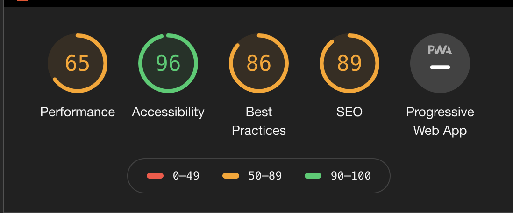
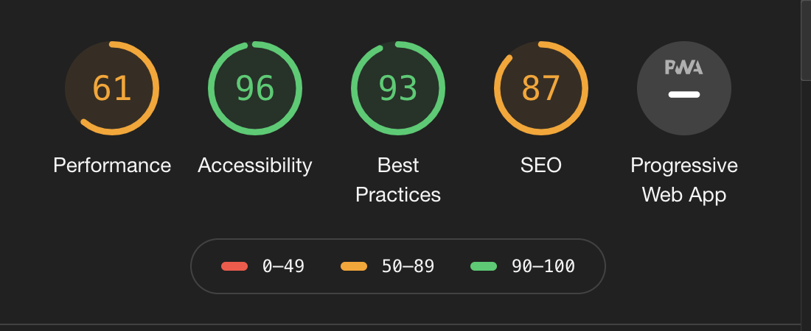

<h2 align=center id="testing-top"></h2>

# [Waggy Box Testing](https://waggy-box.herokuapp.com/)

- [**Main README.md file**](README.md)

- <a href="https://trello.com/b/egLXahHC/testing" target=_blank><strong>All Testing fixes can be reviewed here in this Trello Board</strong></a>

--- 

<h2 align=center id="top"><strong>Table of Contents</strong></h2>

- <a href=#code><h3><strong>Code Testing</strong></h3></a>
    - [**Validator Testing**](#validator-testing)
    - [**Python Unit Testing**](#python-unit-testing)

- <a href=#us-testing><h3><strong>User Story Testing</strong></h3></a>
- <a href=#manual><h3><strong>Manual Testing</strong></h3></a>
    - [**Lighthouse**](#lighthouse)
    - [**Responsive Testing**](#responsive-testing)
        - [**Desktop Testing**](#desktop-testing)
        - [**Laptop Testing**](#laptop-testing)
        - [**Tablet Testing**](#tablet-testing)
        - [**Mobile Testing**](#mobile-testing)

- <a href=#bugs><h3><strong>Bugs Discovered</strong></h3></a>
    - [**Resolved Bugs**](#resolved-bugs)
    - [**Unresolved Bugs**](#unresolved-bugs)

- <a href=#user-testing><h3><strong>Usability Testing</strong></h3></a>

- <a href=#defensive><h3><strong>Defensive Design</strong></h3></a>
    - [**Navbar**](#navbar)
    - [**Footer**](#footer)
    - [**Login/Signup**](#login-signup)
    - [**Shop**](#shop)
    - [**Subscription**](#subscription)
    - [**Contact**](#contact)

<a href=#testing-top><h4 align=right><strong>Back To Top</strong></h4></a>

---

<h2 align=center id="code"><strong>Code Testing</strong></h2>

### **Validator Testing** 

[W3C Markup Validation](https://validator.w3.org/)
 - W3C was used in the validation of both the HTML and CSS for the application.
    - Some minor errors were encountered with `` tags not have an `alt` attribute.  These were resolved shortly after testing. The remainder of the errors noted across each of the pages can be reviewed [here](https://trello.com/b/egLXahHC/testing)  
    - No errors in the CSS were noted. 

[JSHint](https://jshint.com/) was used to validate the Javascript.
- When running the `stripe_elements.js` the JSHint validator these metrics were returned :
    - There are 3 functions in this file.
    - Function with the largest signature takes 1 argument, while the median is 1.
    - The largest function has 8 statements in it, while the median is 5. 
    - The most complex function has a cyclomatic complexity value of 3 while the median is 2.
- No errors were returned. 
- There were two undefined variables: 
    - $ (for JQuery)
    - Stripe (this is from Stripe Docs)

- When running the `subscription.js` through the validator these metrics were returned: 
    - There are 4 functions in this file.
    - Function with the largest signature takes 1 argument, while the median is 1.
    - The largest function has 8 statements in it, while the median is 4.
    - The most complex function has a cyclomatic complexity value of 2 while the median is 1.5.
- No errors were returned.
- Two undefined variables: 
    - $
    - Stripe
- One unused variable :
    - clientSecret

[JSesprima](https://esprima.org/demo/validate.html)
- "Code is syntactically valid" for both files. 

[Python PEP8](https://pypi.org/project/autopep8/)
- The autopep8 extension was installed in the workspace. 
    - To install this enter this in the terminal: 
        -   `pip3 install --upgrade autopep8`

    In order for autopep8 to run, [pycodestyle](https://github.com/PyCQA/pycodestyle) is also required. 
    To instlal pycodestyle, enter this command into the terminal: 
    -  `pip3 install pycodestyle`

- Once these steps are complete, you can format the code into PEP8 formatting by entering this command into the terminal:
    - `autopep8 --in-place --aggressive --aggressive <.py file name>`

### **Python Unit Testing** 

Unit testing was written up to test the core functionality of the site, including rendering pages, checkout, and forms. 

- In the terminal type the following command: 

        python manage.py test <<app name>>

- The test results will be shown within the terminal.

<a href=#testing-top><h4 align=right><strong>Back To Top</strong></h4></a>

---

<h2 align=center id="us-testing"><strong>User Story Testing</strong></h2>
 

1.  **To be able to access the website from any device**
    - This application has been tested across all screen sizes & is shown to be fully responsive.  More about responsive testing undertaken in this application can be read in the below sections. 
2.  **To be  able to find any information on the website in a clear & concise way**
    - Shop items contain a brief overview of the product, including the item name, image, and price, and upon clicking into the item more information is presented in a digestible way that doesn't overwhelm users either.
    - Items on the subscription service are supplied in both a visually and informationally appealing way via bullet points on cards.  Allowing users to get a deep understanding of the type of service they are paying for. 
3. **As a user I expect to find information on the website quickly and effectively.**
    - Both the Navbar & Footer contains information enabling users to access more information about the application.
4. **To be able to find out more information about the company.** 
    - The about page contains a deep review of what the application is about so the user can deep dive into the company's overall structure.
    - There is also a personal addition of the site owners' pets, which shows to users that Waggy Box is made by passionate pet owners rather than a large company. 
5. **To be able to read reviews from customers** 
    - The index pages contain three sample testimonials.
    - Written in a quirky perspective of the dogs themselves rather than the dogs' owners.
    - Testimonials also include images of these dogs, giving the users a feeling of each testimonial is personal. 
6. **To be able to get in contact with the site owner for any reason.** 
    - The site contains a contact form accessible through the main dashboard page and also through the site footer. 
    - The contact form provides an easy way for the user to send an email to the site owner. 
    - The email that is sent to the shop owner includes all the needed info to reply directly to the sender, and the sender is also CC'd in this email so they can review & add any additional information to this by replying to the email. 
7. **To be able to create an account**
    - By using Django AllAuth, users can create accounts.
8. **As a user I expect my information to be stored on the backend so I don't have to re-enter the same information multiple times.**
    - Users are asked to enter their information upon purchasing an item in the shop and purchasing a subscription.
    - They will need to re-enter this information upon canceling their subscription or ordering more items. 
9. **To be able to view information about the subscription I am paying for**
    - Users can review their subscription by accessing the subscription overview page.
10. **As a user I would like to be able to have an option to change my subscription.**
    - Users can also review the benefits of their subscription type by navigating to the 'Review Subscription' link in the Subscription Overview page.  They can easily see what their current subscription is & change it also if they wish. 
11. **As a user, I expect to be able to cancel my membership easily.**
        - If a user would like to cancel their subscription, they will need to accept a modal pop up confirming their desire to cancel.
12. **As a user I expect to be able to review items within the shop.**
    - Users with active subscriptions can access the shop where they can review the items for sale in the shop.
13. **As I user, I expect to be able to gain additional information on this product**
    - Users can gain additional information on the item they would like to purchase by clicking the item image itself.  
14. As a user, I want to make an informed decision about whether to purchase an item in the shop
    - They are re-directed to the item's page, with a description, larger image, price & quantity option with a button to add the item to their cart. 
    - The description housed on this page allows users to make a more informed decision on whether to purchase the item or not. 
15. **To be able to review what I'm paying for all stages in the checkout & payment process.** 
    - The order summary is available at the bottom of all pages through the payment process in the shop.
    - In the subscription page, a review of the selected subscription type is displayed on the top right-hand side of the payment page also.
16. **Get feedback from the website I am using when I interact with it, expecting messages & pop-up feedback to my actions, successful or unsuccessful.**
    - Messages pop up when information is submitted incorrectly.
    - Modals enabling users to complete various requests to ensure they are sure of their actions. 

<a href=#testing-top><h4 align=right><strong>Back To Top</strong></h4></a>

---

<h2 align=center id="manual"><strong>Manual Testing</strong></h2>
 
Extensive manual testing was taken to ensure the application was responsive across all devices and achieved best practices in sofware developement. 

#### **Lighthouse**
An audit was completed using Lighthouse on the Waggy Box page.  Quite a low `performance` mark was returned, and so in an attempt to increase this value, image files were converted from .png to .jpg. 

- After converting the images from .png to .jpg, the following audit was complete:

- Whist the best performance dropped by some, the best practices increased significantly. 
- Upon completing audits of several other websites, such as: 
    - [Code Like a Girl](https://code.likeagirl.io/)
    - [Medium](https://medium.com/)
- I learned that higher markings in Accessibility, Best Practices & SEO were more frequent than having a high-performance rating. 

 

## **Responsive Testing**

### **Desktop Testing**
- 
    | Page | Responsive| Notes| 
    --- | --- | ---
    Index | Y | Fully Responsive. No horizontal scrollbar. 
    About | Y | Fully Responsive.  No horizontal scrollbar. 
    Contact | Y | Fully Responsive.  No horizontal scrollbar. A large button to send an email makes it easy to use. 
    Login | Y | Fully Responsive.  No horizontal scrollbar. A large button to log in makes it easy to use for all users. Form fields rendering quite small. Adjusted to make larger. 
    Sign-Up | Y | Fully Responsive.  No horizontal scrollbar. A large button to log in makes it easy to use for all users. Form fields rendering quite small. Adjusted to make larger. 
    Dashboard | Y | Page is fully responsive, with no horizontal scrollbar or misized images. 
    Subscription Overview | Y | Page is rendering correctly on a large desktop screen. No mis-sized containers or content. 
    Membership List | Y |  Fully responsive, rendering correctly on a large screen. 
    Membership Payment  | Y | Forms are significant in size, large buttons rendering correctly on large screen sizes.
    Shop | Y | Four lines rendering per row.  No cramped spacing & text sizes look well. 
    Shop Item | Y |  No incorrectly sizes content.  Font rendering appropriate sizes. 
    Cart | Y | Rendering well.  Large buttons making accessible for all users.  Large spacing between the primary & secondary buttons. 
    Checkout | Y | This page followed a similar structure to the Membership Payment page.  See notes for this. 
    Checkout Success | Y | Page rendering as intended.  No incorrect shaped content & fonts sizes are appropriate. 

### **Laptop Testing**
- 
    | Page | Responsive| Notes| 
    --- | --- | ---
    Index | Y | Fully Responsive. No horizontal scrollbar. 
    About | Y | Fully Responsive.  No horizontal scrollbar. 
    Contact | Y | Fully Responsive.  No horizontal scrollbar. A large button to send an email makes it easy to use. 
    Login | Y | Fully Responsive.  No horizontal scrollbar. A large button to log in makes it easy to use for all users. Form fields rendering quite small. Adjusted to make larger. 
    Sign-Up | Y | Fully Responsive.  No horizontal scrollbar. A large button to log in makes it easy to use for all users. Form fields rendering quite small. Adjusted to make larger. 
    Dashboard | Y | Page is fully responsive, with no horizontal scrollbar or mis-sized images. 
    Subscription Overview | Y | Page is rendering correctly on a large desktop screen. No mis-sized containers or content. 
    Membership List | Y |  Fully responsive, rendering correctly on a large screen. 
    Membership Payment  | Y | Forms are significant in size, large buttons rendering correctly on large screen sizes.
    Shop | Y | Four lines rendering per row.  No cramped spacing & text sizes look well. 
    Shop Item | Y |  No incorrectly sizes content.  Font rendering appropriate sizes. 
    Cart | Y | Rendering well.  Large buttons making accessible for all users.  Large spacing between the primary & secondary buttons. 
    Checkout | Y | This page followed a similar structure to the Membership Payment page.  See notes for this. 
    Checkout Success | Y | Page rendering as intended.  No incorrect shaped content & fonts sizes are appropriate. 

### **Tablet Testing**
- 
    | Page | Responsive| Notes| 
    --- | --- | ---
    Index | Y | Fully Responsive. No horizontal scrollbar visible and all sections rendering correctly. 
    About | Y | Fully Responsive.  No horizontal scrollbar. Images rendering slightly off-plan to adjust sizing on these. (Adjusted to fit full screen & changed the height of images)
    Contact | Y | Fully Responsive.  No horizontal scrollbar. A large button to send email makes it easy to use on all screen sizes. 
    Login | Y | Rendering correctly.  Form fields are slightly smaller than hoped, however, due to limited knowledge with allauth, unsure of how to adjust this. Large button making is increasingly user friendly.
    Sign-Up | Y | Rendering correctly.  Form fields are slightly smaller than hoped, however, due to limited knowledge with allauth, unsure of how to adjust this.  Use of a large button to make it increasingly user friendly.
    Dashboard | Y | Page is fully responsive, with no horizontal scrollbar or mis-sized images or unintended white space.  
    Subscription Overview | Y | Page is rendering correctly on table. No mis-sized containers or content. 
    Membership List | Y |  Fully responsive, rendering correctly on a tablet screen.  Subscription types rendered on full-screen width make it friendly for all users of all abilities. 
    Membership Payment  | Y | Forms are acceptably sized, large buttons rendering correctly on tablet screens.
    Shop | Y | Three items rendering per row.  No cramped spacing & text sizes look well. 
    Shop Item | Y |  No incorrectly sizes content.  Font rendering appropriate sizes. 
    Cart | Y | Rendering well.  Large buttons making accessible for all users.  Large spacing between the primary & secondary buttons.  Items content is slightly cramped, however limitations on content due to being a table. 
    Checkout | Y | This page followed a similar structure to the Membership Payment page.  See notes for this. 
    Checkout Success | Y | White space rendering on the main image.  Adjusted correctly & resolved by decreasing the padding on tablet screens & smaller. 

### **Mobile Testing**
- 
    | Page | Responsive| Notes| 
    --- | --- | ---
    Index | Y | Fully Responsive. No horizontal scrollbar visible and all sections rendering correctly. 
    About | Y | Fully Responsive.  No horizontal scrollbar. Image rendering correctly & with shadow on the main text, it's clear to see.  Removed padding-top on dog images to appear correctly.
    Contact | Y | Fully Responsive.  No horizontal scrollbar. A large button to send an email makes it easy to use on all screen sizes. 
    Login | Y | Rendering correctly.  Form fields are slightly smaller than hoped, however, due to limited knowledge with allauth, unsure of how to adjust this. Large button making is increasingly user friendly.
    Sign-Up | Y | Rendering correctly.  Form fields are slightly smaller than hoped, however, due to limited knowledge with allauth, unsure of how to adjust this.  Use of a large button to make it increasingly user friendly.
    Dashboard | Y | Page is fully responsive, with no horizontal scrollbar or mis-sized images or unintended white space.  
    Subscription Overview | Y | Page is rendering correctly on table. No mis-sized containers or content. 
    Membership List | Y |  Fully responsive, rendering correctly on a mobile screen.  Subscription types rendered on full-screen width, make it friendly for all users of all abilities. 
    Membership Payment  | Y | Forms are accurately sized being the full width of the screen, large buttons rendering correctly on mobile screens.
    Shop | Y | Three items rendering per row.  No cramped spacing & text sizes look well. 
    Shop Item | Y |  No incorrectly sizes content.  Font rendering appropriate sizes. 
    Cart | Y | Rendering well.  Not optimized for a small phone screen, due to cramped information.  Some styling customized for small mobile, but product image still rendering small despite attempts to resolve. 
    Checkout | Y | This page followed a similar structure to the Membership Payment page.  See notes for this. 
    Checkout Success | Y | Rendering well.  Dark text visible against the light background. Dark text not fully visible.  Looking into making this better - `text-shadow: 0.8px 0.8px gray;` was added on screens less than 1000px to the subtext.

<a href=#testing-top><h4 align=right><strong>Back To Top</strong></h4></a>

---

<h2 align=center id="bugs"><strong>Bugs Discovered</strong></h2>

### **Resolved Bugs**

1) A significant issue with Stripe working in the subscription during creation was discovered in getting the Stripe Token to correctly populate.  Thanks to the help from Simen Daehlin, this was resolved by manually adding the public key for Stripe in the membership_payment.html page. 
2) When the Database is empty, an error occurs with the subscription. 
    - This was discovered to be down to the lack of memberships.
    - Resolved by commenting out two lines during the development & re-filling these lines once deployment was ready.
    - Further development would be required to resolve fully without lines needing to be commented during development.
3) A large issue came up when attempting to move from SQLite to PostgreSQL databases. 
    - Upon inspection, the error seemed to be coming from the CountryField in the forms.
    - To resolve, I removed this form & undone any migrations relating to this.
    - A future feature I would like to re-incorporate into the application would be country selections. 
4) Gitpod was unable to access PostgreSQL database for testing
    - Due to the free Hobby-dev Postgres package selected when setting up the Heroku database, I was not able to set the permissions necessary to allow Django to create a test database when running manage.py test.
    - To fix this I reverted to accessing my sqlite3 database for testing.

###  **Unresolved Bugs**
1) Cart page images not hiding on a small screen.
    - This seems to be an issue with the MDB framework, however, when relevant classes were applied to product items, instead of hiding one image on a small screen & displaying another, both images were rendering to display.
2) Allauth form fields rending significantly smaller than desired.  Due to a limited understanding of Django Allauth, I was unable to resolve this, however, would like to look into this in the near future. 

<a href=#testing-top><h4 align=right><strong>Back To Top</strong></h4></a>

--- 

<h2 align=center id="user-testing"><strong>Usability Testing</strong></h2>

- A site-wide usability test was conducted.  The user was presented with the following aims:
    - You are the owner of a large dog breed.  After tirelessly seeking good quality dog toys, you have given up. Until you come across the Waggy Box application.
    - Navigate to the `About Us` page to learn more about the Waggy Box company.
    - After reading the about page, you would love to sign up and try out the service. Navigate to the sign-up page & create an account. 
    - Review the subscriptions available to you and purchase the `Premium` subscription type.
    - Enter your delivery and payment information and purchase the subscription.
    - Now you would like to review some of the items in last month's box, to get a good idea of the type of products you are sent each month.
    - You spotted an item you would like to purchase.  You would like to find out more about the item, and purchase two of these products.
    - Enter your details & checkout.
    - Now your item has arrived, but there seems to be an issue with the payments, and you were charged for three items instead of 2.  You need to get in touch with the site owner to resolve this.

- **User Testing Feedback** 
    - The option to allow users to subscribe straight from signing up. (Added to future implementations)
    - Adjusting the width of buttons to allow for a more mobile-friendly user - this was done & has greatly improved the UX. 

<a href=#testing-top><h4 align=right><strong>Back To Top</strong></h4></a>

---

<h2 align=center id="defensive"><strong>Defensive Testing</strong></h2>

- #### **Navbar** 
    - All links were tested & deemed to be fully functional, directing users to the desired location. 
    - Logo redirects the user to the index page if logged out when logged in it redirects the user to the dashboard page.
- #### **Footer** 
    - Links to pages were tested & again deemed to be fully functional, directing users to the desired location to the `<a>` name.
    - Icons navigate to relevant external links when clicked & a new tab is opened for navigating to this page. 
- #### **Login Signup** 
    - Links in these pages functioned correctly.
    - Buttons performed desired actions.
    - Required fields in forms rendered an error when not filled correctly.
    - Messages displayed if the information was submitted incorrectly. 
- #### **Subscription Pages** 
    - All links to other pages were checked & deemed rending correctly.
    - Buttons performed the desired actions. 
    - Pop-up modal on subscription overview page working correctly & only triggered upon clicking a button.
    - Buttons performed desired actions & rendered to correct page.
    - Any forms that needed to be filled out flashed relevant errors if filled incorrectly.
    - Error messages flashed as desired when forms or pages were submitted incorrectly.
- #### **Shop Pages** 
    - Page links performed desired action when required.
    - Shop pages do not display to users without an acitve paid subscription.
    - Buttons performed desired actions & when aimed, rendered the correct page.
    - Any forms that needed to be filled out flashed relevant errors if filled incorrectly.
    - Error messages flashed as desired when forms or pages were submitted incorrectly.
- #### **Contact Page** 
    - Links perform the correct actions.
    - Send button sends contact form & email gets delivered to the site owner and the sender for review. 
    - Form flags error message if attempted submission and information is incorrect.
    - Messages display when a form is sent correctly or if an error occurs when attempting to send. 

<a href=#testing-top><h4 align=right><strong>Back To Top</strong></h4></a>